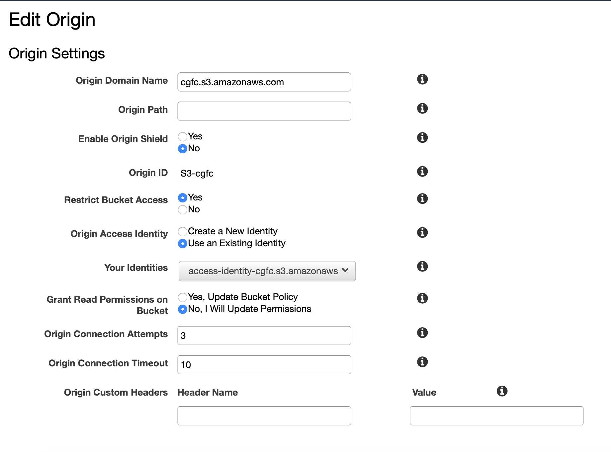

# cgfc-owner-portal
Protect sensitive web pages to only allow active owners to view

## Approach
This is a serverless solution that relies on AWS CloudFront to call a Lambda authorizer before allowing access to the
contents of an S3 object.

## Populate DynamoDB
This db holds the list of owners in good standing.
- Create a table with a string partition key named `owner_id`
- Use the [load_active_owners.py](load_active_owners.py) script to populate this table

## Create Lambda Function
This is the function that will be the authorizer for the CloudFront distribution. It will redirect the user to the
request form if the basic auth tokens doesn't match a ownerID/last name pair.
- The lambda executing role will need read access to the dynamo DB

## CloudFront Configuration
- Setup an intial set of pages in an S3 bucket with global public access
- Create a CloudFront distribution
- Create an origin:
  - Origin Domain name is the url of your bucket
  - Create origin access identity


- Add a behaviour
  - Path pattern is the name of the html object you wish to protect
  - Associate the lambda function with a _Viewer Request_ CloudFront event


## Secure the Meeting Info Page
Edit the bucket policy on the secret page to block public access, and only allow access to the CloudFront origin access
identity:
```
{
    "Version": "2008-10-17",
    "Id": "PolicyForCloudFrontPrivateContent",
    "Statement": [
        {
            "Sid": "Allow-Public-Access-To-Bucket",
            "Effect": "Allow",
            "Principal": "*",
            "Action": "s3:GetObject",
            "Resource": "arn:aws:s3:::cgfc/*"
        },
        {
            "Sid": "ProtectMeetingInfo",
            "Effect": "Deny",
            "Principal": "*",
            "Action": "s3:GetObject",
            "Resource": "arn:aws:s3:::cgfc/meeting_info.htm"
        },
        {
            "Sid": "2",
            "Effect": "Allow",
            "Principal": {
                "AWS": "arn:aws:iam::cloudfront:user/CloudFront Origin Access Identity________"
            },
            "Action": "s3:GetObject",
            "Resource": "arn:aws:s3:::cgfc/*"
        }
    ]
}
```
  
